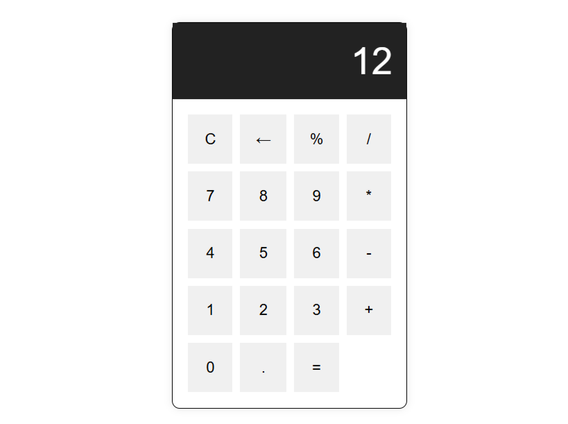

# 🧮 Calculator App

A simple calculator web application built with **HTML, CSS, and JavaScript**.  
This project demonstrates DOM manipulation, event handling, and basic CSS styling.

---

## 🚀 Features
* Clear (`C`) button to reset the display.
* Delete (`←`) button to remove the last entered digit/operator.
* Supports `+`, `-`, `*`, `/`, `%`.
* Decimal point support.
* Responsive and clean UI.

---

## 🛠️ Tech Stack
* **HTML** – Structure of the calculator.
* **CSS** – Styling with Grid layout and hover effects.
* **JavaScript** – Core logic for handling input & calculations.

---

## 📸 Screenshot

